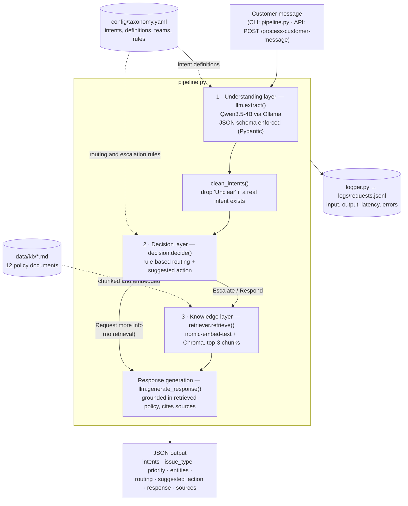
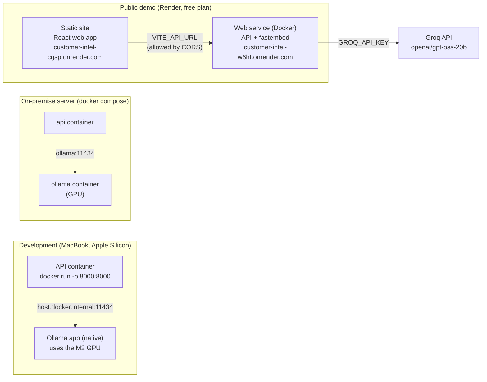

# Architecture

## Request flow

## Layers (PDF §8)

| PDF layer | Implementation |
|---|---|
| 1. Input Layer | `pipeline.py` (CLI), `app.py` (FastAPI, input validated by Pydantic) |
| 2. Prompt Engineering Layer | `llm.build_system_prompt()` — role, intent definitions from the taxonomy, priority guide |
| 3. LLM Reasoning Layer | `llm.extract()` — Qwen3.5-4B, temperature 0, thinking off |
| 4. Retrieval Layer (Vector DB) | `retriever.py` — 71 chunks, nomic-embed-text embeddings, Chroma (cosine) |
| 5. Output Structuring Layer | Ollama constrained decoding with the Pydantic JSON schema + `model_validate_json` |
| 6. Logging Layer | `logger.py` — one JSON line per request, including failures |

The decision layer (`decision.py`) sits between reasoning and retrieval: the LLM **extracts**, deterministic rules **decide**.

**Two backends.** The diagram shows local mode. With `LLM_PROVIDER=groq`, `llm.py` calls `openai/gpt-oss-20b` on Groq (strict JSON schema), and `retriever.py` uses `bge-small-en-v1.5` in-process (fastembed) with an in-memory search instead of Ollama + Chroma. The decision rules, prompts, logging and API are identical in both modes. The React web app in `frontend/` calls the same API.

## Deployment

The public demo uses `LLM_PROVIDER=groq`, so its API container needs no GPU and fits Render's free plan (512 MB RAM). The web app is served separately as static files, so it loads instantly even while the API is waking up from sleep.

The model always runs as a **separate service** from the API: the API image stays small, the model can use a GPU, and either can be updated or scaled without rebuilding the other. The API only needs the `OLLAMA_HOST` environment variable to find it.
